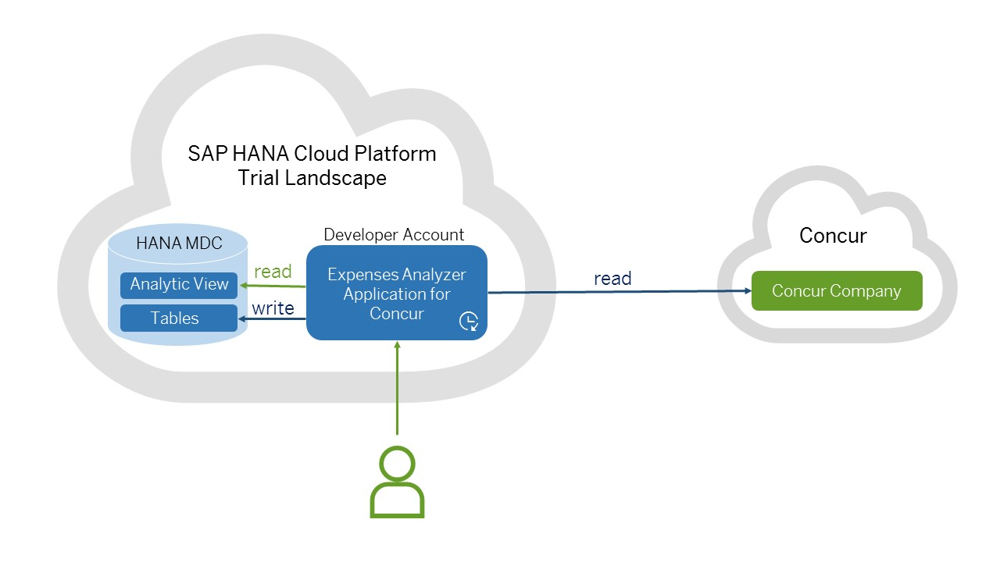

# Expenses Analyzer for Concur

## Content:

- [Overview](#overview)
- [Technical Details](#technical_details)
- [Prerequisites](#prerequisites)
- [Set Up the MDC Database](#setup_database)
- [Build and Deploy the Application on SAP HANA Cloud Platform](#build_deploy)
	- [Using the SAP HANA Cloud Platform Cockpit](#build_deploy_cockpit) 
	- [Using the Eclipse IDE](#build_deploy_eclipse)
- [Bind the Application Data Source with the MDC Database and Create a Destination](#configure)
- [Start the Expenses Analyzer for Concur Application](#start)
- [Set Up the Application in Concur](#setup_concur)
	- [Set Up Partner Application](#setup_concur_partner_application)
	- [Set Up Technical User](#setup_concur_technical_user)
    - [Generate an Access Token](#setup_concur_access_token)
- [Generate and Approve Sample Expenses in Concur](#concur_sample_expenses)
- [Additional Information](#additional_information)
	- [Resources](#additional_information_resources)
	- [License](#additional_information_license)

<a name="overview"/>
## Overview

Expenses Analyzer for Concur is a sample extension application for [Concur](https://www.concur.com/) that runs on [SAP HANA Cloud Platform](https://hcp.sap.com/) and uses a HANA database. The purpose of the application is to show you analytical information about all expenses in your Concur company.

The application can be either run on the productive SAP HANA Cloud Platform landscape with a dedicated HANA, or the trial landscape with a multitenant database containers (MDC) database. This guide explains how to download, build, deploy and configure the application on the SAP HANA Cloud Platform trial landscape. 

These are the SAP HANA Cloud Platform services and features in use:
* [Connectivity Service](https://help.hana.ondemand.com/help/frameset.htm?e54cc8fbbb571014beb5caaf6aa31280.html) - the application uses the Connectivity Service to obtain connection to Concur.
* [Persistence Service](https://help.hana.ondemand.com/help/frameset.htm?e7b3c275bb571014a910b3fb4329cf09.html) - the application uses the Persistence Service to manage its connection to the database.
* [Identity Service](https://help.hana.ondemand.com/cloud_identity/frameset.htm) - the application uses the Identity Service to manage its security.
* [Trial MDC database](https://help.hana.ondemand.com/help/frameset.htm?920f2440fad245da93604c2623f0426a.html) - the application uses an MDC database.

<a name="technical_details"/>
## Technical Details
The Expenses Analyzer for Concur is a Java application that performs regular data replication from your Concur company into an MDC database. This data serves as a base for a HANA Analytical View. As a result, you can leverage the computing power of the MDC database, which performs analytical computations on top of expenses data from Concur.

<p align="center">
  
</p>

To use this extension application, you need to:

1. Adjust the MDC database that it uses.
2. Build and deploy the application on SAP HANA Cloud Platform.
3. Bind the application to the MDC database.
4. Start the application.
4. Set up the application in Concur.

<a name="prerequisites"/>
## Prerequisites

You need to:
* [provision a Concur sandbox company](https://developer.concur.com/api-reference/#provision-sandbox)
* have an [SAP HANA Cloud Platform developer account](https://help.hana.ondemand.com/help/frameset.htm?e4986153bb571014a2ddc2fdd682ee90.html)
* have an [SAP HANA MDC database started](http://scn.sap.com/community/developer-center/cloud-platform/blog/2016/01/13/sap-hana-multitenant-database-containers-mdc-scenarios-now-on-trial-landscape) and add the necessary roles described in the Web IDE scenario in the same blog
* download or clone the project with Git
* have set up [Maven 3.0.x](http://maven.apache.org/docs/3.0.5/release-notes.html)

<a name="setup_database"/>
## Set Up the MDC Database
In order to set up the MDC database for the Expenses Analyzer for Concur, you need to import a Delivery Unit and create a database technical user dedicated to the application.

In order to import Delivery Units, your MDC user needs the _sap.hana.xs.lm.roles::Administrator_ role. In order to create new MDC users, your MDC user needs the system privilege _USER ADMIN_. To assign these roles to the user do the following:

  1. In the [SAP HANA Cloud Platform Cockpit](https://account.hanatrial.ondemand.com/), choose your account, go to the _Databases & Schemas_ tab and then choose your HANA MDC database.
  2. Open the _SAP HANA Cockpit_ and then choose the _Manage Roles and Users_ tile. 
  3. Expand _Security_ > _Users_ and find your user.
  4. Assign the user the _sap.hana.xs.lm.roles::Administrator_ role from the _Granted Roles_ tab.
  5. Assign the user the _USER ADMIN_ privilege from the _System Privileges_ tab. 
  6. Save the changes.

### Import HANA Delivery Unit

You need to [import a HANA delivery unit into your MDC database](https://help.sap.com/saphelp_hanaplatform/helpdata/en/e6/c0c1f7373f417894e1f73be9f0e2fd/content.htm). The delivery unit contains the application schema, tables, roles, and views. It is called `EXPENSES_ANALYZER_FOR_CONCUR_TRIAL.tgz` and is available in the project folder `cloud-concur-expenses-analyzer-ext\`.

  1. In the [SAP HANA Cloud Platform Cockpit](https://account.hanatrial.ondemand.com/), choose your account, go to the _Databases & Schemas_ tab and then choose your MDC database.
  2. Open the _SAP HANA Cockpit_ and login with your MDC user. 
  3. Choose the _HANA Application Lifecycle Management_.
  4. Choose the _PRODUCTS_ tab.
  5. Choose the _Delivery Units_ tab.
  6. Choose _Import_.
  7. Select `EXPENSES_ANALYZER_FOR_CONCUR_TRIAL.tgz` that is available in the project folder `cloud-concur-expenses-analyzer-ext\`.
  8. Choose _Browse_ to display a file explorer, which you can use to locate the DU you want to import, and choose _Open_.

### Create a technical MDC user

You need to [create a technical MDC user] 
(https://help.sap.com/saphelp_hanaplatform/helpdata/en/c0/555f0bbb5710148faabb0a6e35c457/content.htm) dedicated to the application.

  1. In the [SAP HANA Cloud Platform Cockpit](https://account.hanatrial.ondemand.com/), choose your account, go to the _Databases & Schemas_ tab and then choose your HANA database.
  2. Open the _SAP HANA Cockpit_ and then choose the _Manage Roles and Users_ tile. 
  3. Expand _Security_ > _Users_ and from the context menu choose _New User_.
  4. Enter the username and the password and save the changes.
  5. Open the new user from the structure on the left. 
  7. [Assign the HANA user the role](https://help.sap.com/saphelp_hanaplatform/helpdata/en/c0/555f0bbb5710148faabb0a6e35c457/content.htm) `com.sap.hcp.extensions.concur.trialeac::SHCPExtensionsForConcurTrialEAC`. This role allows the user to insert data into and select data from the table where the expenses are stored. It also allows select on the HANA analytical view.

>Note: After creating the technical MDC user, make a single login with this user since the initial password must be changed before using it.

<a name="build_deploy"/>
## Build and Deploy the Application on SAP HANA Cloud Platform

You have already downloaded or cloned the Expenses Analyzer for Concur. Now you have to build the application and deploy it on the SAP HANA Cloud Platform. There are two paths you can choose from: 

* using the SAP HANA Cloud Platform Cockpit
* using the Eclipse IDE

<a name="build_deploy_cockpit"/>
### Using the SAP HANA Cloud Platform Cockpit

#### Build the Application

1. Go to the `cloud-concur-expenses-analyzer-ext` folder.
2. Build the project with:

        mvn clean install

The produced WAR file `ROOT.war` under target sub-folder `cloud-concur-expenses-analyzer-ext\target` is ready to be deployed.

#### Deploy the Application Using the Cockpit

You have to [deploy](https://help.hana.ondemand.com/help/frameset.htm?abded969628240259d486c4b29b3948c.html) the `ROOT.war` file as a Java application via SAP HANA Cloud Platform Cockpit. Use Java Web Tomcat 7 as a runtime option.

>Caution: Make sure you only deploy the application without starting it. You need to bind the application to the data source first.

<a name="build_deploy_eclipse"/>
### Using the Eclipse IDE

When using the Eclipse IDE you can take a look at the structure and code of the application. You have to import the application as an existing Maven project and build it with Maven using `clean install`. You also have to choose Java Web Tomcat 7 as a runtime option.

#### Prerequisites

* [JDK 7 or later](http://www.oracle.com/technetwork/java/javase/downloads/jre7-downloads-1880261.html)
* [Eclipse IDE for Java EE Developers](https://eclipse.org/downloads/)
* [SAP HANA Cloud Platform Tools](https://tools.hana.ondemand.com/#cloud) ([Installation help](https://help.hana.ondemand.com/help/frameset.htm?e815ca4cbb5710148376c549fd74c0db.html))

#### Build the Application from Eclipse

1. You have to clone the `cloud-concur-expenses-analyzer-ext` project. 
      1. Оpen the _Git_ Perspective. Choose _Windows_ > _Open Perspective_ > _Other_. Select _Git_ and choose _OK_. 
      2. Choose _Clone a Git repository_.
      3. Enter `https://github.com/SAP/cloud-concur-expenses-analyzer-ext.git` in the _URI_ field and choose _Next_.
      4. Set the _Directory_ field and choose _Finish_.
      
2. You have to import the `cloud-concur-expenses-analyzer-ext` project as an existing Maven project and then build it.
      1. In the _Java EE_ perspective, choose _File_ > _Import_ > _Maven_ > _Existing Maven Project_. 
      2. Browse and select the folder where you have cloned the Git repository and choose _Finish_. Wait for the project to load.
      3. From the project context menu, choose _Run As_ > _Maven Build_.
      4. Enter `clean install` in the _Goals_ field and choose _Run_.
         The build should pass successfully.

#### Deploy the Application from Eclipse

To deploy the application from Eclipse IDE, follow these steps:

1. In the _Servers_ view right-click on the white field and choose _New_ > _Server_. 
2. Select _SAP HANA Cloud Platform_ and choose _Next_.
3. Select _Java Web Tomcat 7_ as a runtime option. 
4. Add the `hotels.provider` application to the _Configured_ field and choose _Finish_.

<a name="configure"/>
## Bind the Application Data Source with the MDC Database and Create a Destination

You need to bind the application data source with the MDC database and create a destination on the SAP HANA Cloud Platform.

1. [Create a new data source binding for the Java application](https://help.hana.ondemand.com/help/frameset.htm?5936fbafb1384df49dd9bba7cd71219d.html) for the MDC database. Use the MDC database user you already created.
>Note: If there is a default data source binding already created, you have to delete it.
       Make sure the binding is to the MDC database.
	   
	1. In the [SAP HANA Cloud Cockpit](https://account.hanatrial.ondemand.com/), go to _Databases&Schemas_ and choose your MDC database. 
	2. Choose _New Binding_. Enter the Java application you have deployed and enter the credentials of the technical MDC user you have already created.

2. [Create an HTTP destination on application level](https://help.hana.ondemand.com/help/frameset.htm?1e110da0ddd8453aaf5aed2485d84f25.html).

   Use the following required properties:

                Name: concur-api
                URL: <the url of the Concur instance, e.g. https://www.concursolutions.com/>
                
   And add one additional property:

                AccessToken: <an OAuth access token that is about to be created>

<a name="start"/>
## Start the Application

After creating the data source binding and the destination, [start (or restart in case the application is already started) of the application via the Cloud Cockpit](https://help.hana.ondemand.com/help/frameset.htm?7612f03c711e1014839a8273b0e91070.html). 

<a name="setup_concur"/>
## Set Up the Application in Concur

The Expenses Analyzer for Concur application requires an OAuth access token for the Concur company. In this way it is able to communicate with Concur on behalf of the company owner. To generate this token you need to: 

* register a partner application in Concur and get its application key
* register a technical user in Concur and get its credentials
* generate the OAuth access token using the application key and the user credentials

<a name="setup_concur_partner_application"/>
### Set Up Partner Application

You can either configure and use the default sandbox partner application or register a new partner application.

#### Configure and Use the Default Sandbox Partner Application

You log in Concur using the credentials of the company registered there. You need to have an Administrator authorization to configure partner applications.

1. Go to _Administration_ > _Company_ > _Web Services_ > _Register Partner Application_. You already have the default sandbox partner application there. Double-click on it.
2. Set the checkbox **Expense Report - Add, Approve, or Update Expense Reports APIs**

The partner application comes with an **application key** that will be used when generating the access token. You can find this key in the _Application Authorization_ section.

#### Register a new Partner Application (optional)

If [you register a new partner application](https://developer.concur.com/manage-apps/partner-applications.html) instead of using the default one, make sure it has permissions to access **Expense Report - Add, Approve, or Update Expense Reports APIs**.

Again - the partner application comes with an **application key** that will be used when generating the access token. You can find this key in the _Application Authorization_ section.

<a name="setup_concur_technical_user"/>
### Set Up Technical User

You can use the sandbox user or register a new technical user. 

You need a technical user in your Concur company, so that the Expenses Analyzer for Concur application can perform regular data replication from this company into a HANA database. The technical user is just a user that is related only to this application. 

#### Use the Sandbox User
For test purposes, instead of creating a dedicated technical user, you can use the sandbox user.

#### Register a Technical User (optional)

You log in in Concur using the credentials of the company registered there. You need to have an Administrator authorization to create a technical user. 

1. Go to _Administration_ > _Setup_ > _Expense_.  
2. In the menu on the left, choose _Users_ and then _Create/Edit User_.
3. These are some of the fields you have to fill in:
 
  * _Reimbursement Method_: select one of the options from the drop-down menu. 
  * _User Permissions_: set all the checkboxes in the _Expense_ section.
     
4. Choose _Save_ and then _Done_.

<a name="setup_concur_access_token"/>
### Generate an Access Token

You need an access token for your technical user in Concur. This token is used by the Expenses Analyzer for Concur application to communicate with Concur on behalf of the technical user.

The token can be generated via the [Concur Native authorization flow](https://developer.concur.com/api-reference/authentication/authentication.html).

This is what you have to do:

1. Use a REST client of your choice for making the calls. For example, Postman, or other tool.
2. Make a GET request with this URL: https://www.concursolutions.com/net2/oauth2/accesstoken.ashx and add two headers:
   * **X-ConsumerKey** header with value the **key** from the Concur partner application. 
   * **Authorization** header must include Base-64 encoded credentials (LoginID:Password) of the Concur technical/sandbox user in the HTTP Basic Authentication format.

<a name="setup_concur_access_token_use"/>
### Use the Access Token

You can now fill the generated OAuth access token in the `concur-api` destination.

<a name="concur_sample_expenses"/>
## Generate and Approve Sample Expenses in Concur

The Expenses Analyzer for Concur uses Concur expenses reports. You need to add and process a few such reports to be able to see them in the Expenses Analyzer application.

You log in in Concur using the credentials of the company registered there. 

To be able to create and process expenses reports in a sandbox company, you need one user with rights to submit expense reports and another user with rights to process and approve expense reports. For the purposes of the example, you can use one and the same user for both creating expenses and processing them.

1. Open [Concur](https://www.concursolutions.com/) and log in with your Concur user, e.g. the default sandbox user.
2. Go to _Administration_ > _Setup_ > _Expense_.
3. Go to the _Accounting_ section. In the _Select your accounting software_ field, select _Intuit QuickBooks Desktop: Pro, Premier and Enterprise_ or _Intuit QuickBooks Online_ options.
4. Go to _Users_, select your user (e.g. the default sandbox user) and then select _Create/Edit User_. Choose a reimbursement method from the drop-down with the same name and save the changes. The user needs all rights to work with expenses - _Can Process Expense Reports_, _Can Submit Expense Reports_, _Can Approve Expense Reports_.
5. Go to _Expense_ > _Expense Types_ > _Account Codes_ and make sure there are account codes entered for a few expense types.

To create and process an expense report, you need to:

1. Open [Concur](https://www.concursolutions.com/) and log in with the Concur user that was configured in the previous step (e.g. the default sandbox user).
2. From the home screen, go to _Expense_ > _Manage Expenses_ and choose _Create New Report_.
3. Fill in the _Report Name_ field, for example _My trip to Berlin_. Choose _Next_.
5. Enter some expenses in the report according to your sandbox company setup. Choose _Submit Report_.
6. If the report is in _Submitted & Pending Approval_ state, you need to approve it. Go to _Approvals_ tab, choose expense report you want to approve, and then _Approve_.
7. If the report is in _Approved & In Accounting Review_, you need to process it. Go to _Expense_ > _Process Reports_ tab, choose the report you want to process, and then _Change Approval Status_. Select _Approved_ and then choose _Save_.
8. Go to _Administration_ > _Company_ > _Tools_ > _Payment Manager_. Find the newly created batch and select _close now_.

The report is now closed and available for the Expenses Analyzer application.

<a name="additional_information"/>
## Additional Information

<a name="additional_information_resources"/>
### Resources
* SAP HANA Cloud Documentation - https://help.hana.ondemand.com/
* Concur API - https://developer.concur.com/api-reference/index.html

<a name="additional_information_license"/>
### License

```
© 2016 [SAP SE](http://www.sap.com/)

Licensed under the Apache License, Version 2.0 (the "License"); 
you may not use this work except in compliance with the License. 
You may obtain a copy of the License in the LICENSE file, or at 

http://www.apache.org/licenses/LICENSE-2.0 

Unless required by applicable law or agreed to in writing, software 
distributed under the License is distributed on an "AS IS" BASIS, 
WITHOUT WARRANTIES OR CONDITIONS OF ANY KIND, either express or implied. 
See the License for the specific language governing permissions and 
limitations under the License.
```
